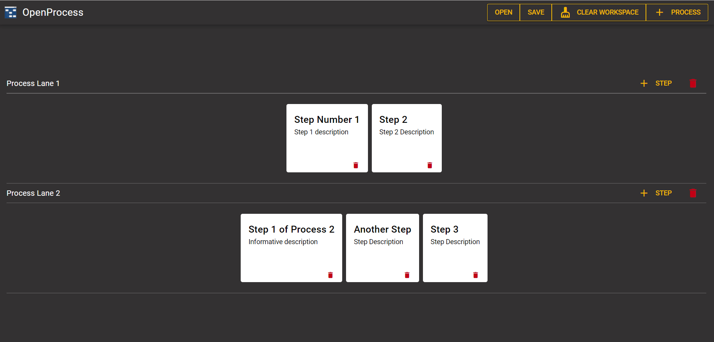
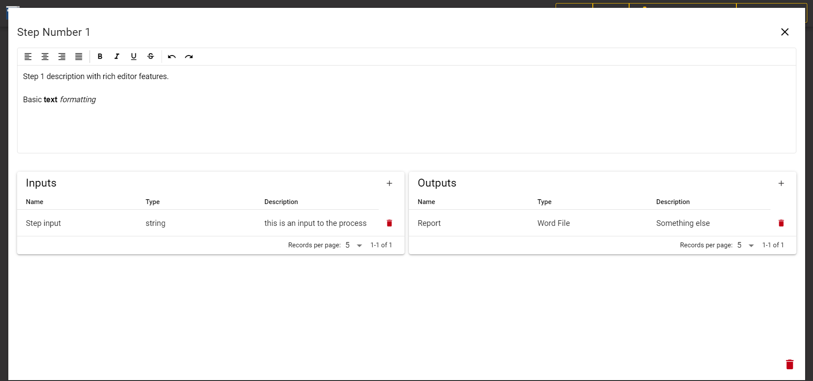
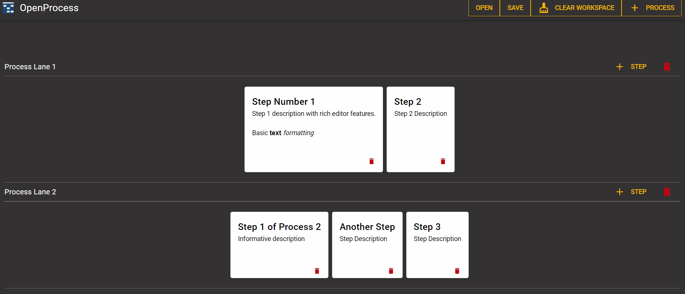
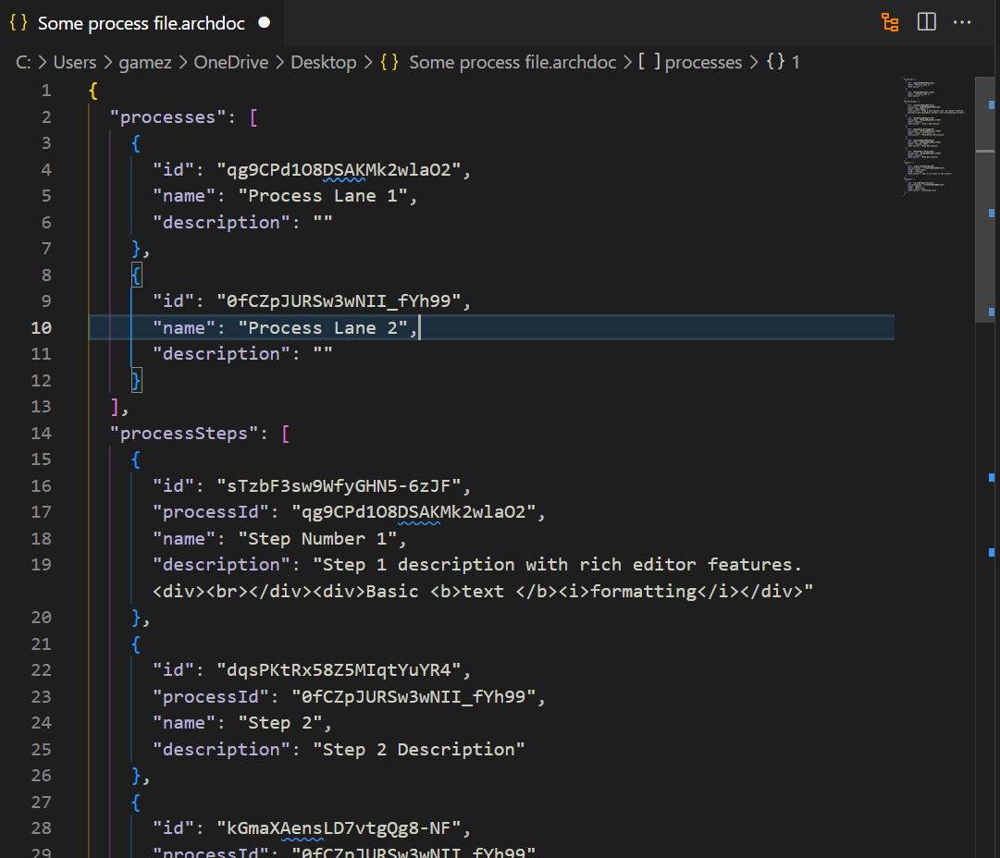

# OpenProcess

_A simple process documentation tool_

Check the [sample app here](https://open-process.novaenergy.digital)

## Document processes in simple and practical way

## Describe each step and document inputs/outputs

## Drag-and-drop steps between process lanes

## Save and retrieve processes in files using a JSON format

## Installation and building

Run `npm install` and `npm run build`

Your files will be on the `dist` folder ready to deploy on any server

For local development use `npm run dev`

## OpenProcess uses these fantastic open-source tools, frameworks and libraries

- [Quasar](https://quasar.dev/)
- [VueJS](https://vuejs.org/)
- [VueUse](https://vueuse.org/)
- [Pinia](https://pinia.vuejs.org/)
- [PiniaORM](https://pinia-orm.codedredd.de/)
- [Pinia Plugin Persisted State](https://github.com/prazdevs/pinia-plugin-persistedstate)

## LICENSE [MIT](./LICENSE)
